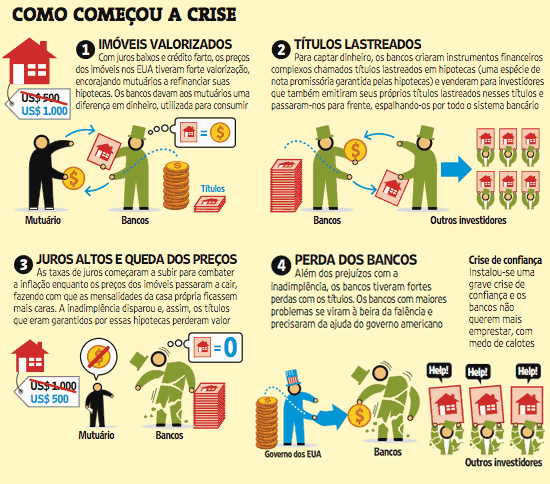
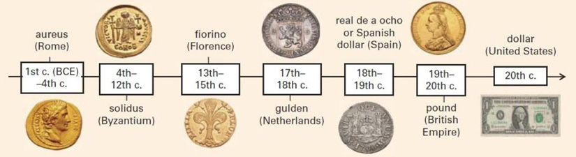
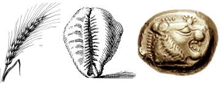

## Ideologia

 O Criptoanarquismo é uma vertente do anarcocapitalismo que tem como principal preocupação garantir a privacidade e a liberdade extra-estatal, por meio da utilização de criptografia assimétrica.

 O termo popularizado por Timothy C. May, é descrito como a realização ciber-espacial do anarquismo. Os cripto-anarquistas tem entre seus objetivos a criação de um software criptográfico capaz de impossibilitar processos judiciais e outras formas repressão ao se enviar e receber informação nas redes de computadores. Timothy C. May escreve sobre o cripto-anarquismo no [Cyphernomicon](http://dicionario.sensagent.com/Criptoanarquismo/pt-pt)

## A criação do Bitcoin

 O Bitcoin, tem como raiz, o movimento que chamou a atenção do Mundo na década 80 e 90! Que é: o movimento cypherpunk, que lutava pela autnomia do indivíduo em relação aos seus dados.

 O que significa que há mais de 30 anos, a privacidade e segurança já eram preocupações reais.

 [Cypherpunk](https://www.tecmundo.com.br/criptografia/41665-cypherpunk-o-ativismo-do-futuro.htm) é a junção das palávras **cypher**, referente a criptografia, e **punk**, a subcultura underground; ambos aliados à tecnologias de informação e cibernética num empenho de resistência ao "establishment" ao pensamento social dominante, ou seja, o "mainstream".

  Do movimento, nasceram projetos condizentes com os ideais, como sistemas financeiros distribuídos pela internet, protegidos por criptografia para a proteção do indivíduo e seus dados.

  Porém o único projeto que conseguiu manter-se operacional devido a sua enorme adoção, foi o Bitcoin.

 Depois do caos de 2008, gerado pela crise do subprime, o sistema financeiro dos EUA enfrentou o descredito e desconfiança!

 E foi nesse momento que surgiu a proposta de criação do Bitcoin!

 > [!NOTE]
 > Embora a forte coincidência temporal, não se pode afirmar, que o Bitcoin surgiu em resposta direta à crise do subprime.

## A criação

 Nesse contexto de desconfiança, após a crise, um **whitepaper**, assinado por **Satoshi Nakamoto** de nome [**Bitcoin: A Peer-to-Peer Electronic Cash System**](https://bitcoin.org/bitcoin.pdf) surgiu na Internet!

 Porém até os dias de hoje, "Satoshi Nakamoto" é tido como um pseudônimo, já que a pessoa ou pessoas não tiveram sua identidade revelada e confirmada.

 Sendo esse, mais uma grande mistéio da nossa Internet.

## O whitepaper, o Bitcoin

 Satoshi propôs a criação de um sistema financeiro alternativo, onde trocas e liquidação de pagamentos são combinados, de forma a promover a liberdade, a qualquer indivíduo, de fazer trocas financeiras (P2P - peer to peer) sem a intermediação de uma instituição reguladora/financeira.

 Dando poder às pessoas de fazerem transferêncis e pagamentos sem a necessidade do uso do sistema financeiro tradicional(bancos estatais e privados, bancos centrais, corretoras, etc... ).

 E devido a consistência do projeto, sua adoção e, até o momento, a inexistência de problemas que comprometam o sistema, o Bitcoin tem ganhado cada vez mais força.

 Temos então, um novo e funcional, paradigma de sistema financeiro, descentralizado e sem a coerção de controle e subtração do Estado.

## A contrainformção

> **contrainformação** ação ou estratégia para impedir ao inimigo ou a uma entidade o acesso a informação verdadeira, nomeadamente com divulgação de informações falsas.

 Muito se falou do Bitcoin ser ou não uma pirâmide ou crime contra a economia popuplar. Porém para se caracterizar crime, é preciso que exista um autor, um responsável! E quem poderia ser ele: Satoshi ? A casa de câmbio ? O consumidor que faz uso de um sistema?

 **2012** o ano em que o **BCE** determina que o **Bitcoin** é **legal**
 O [relatório, de 2012, sobre o Bitcoin, do BCE - Banco Central Europeu](https://www.ecb.europa.eu/pub/pdf/other/virtualcurrencyschemes201210en.pdf), uma autoridade cuja reputação compara-se à de Paul Krugman e Nouriel Roubini, página 22, dedica-se à justificativa teórica do Bitcoin, referindo-se à escola austríaca, que se posiciona contra “fiat money” e a favor do padrão de ouro.

 Também, sobre ser uma pirâmide (“Ponzi scheme”), é discutida na página 28. E em teoria, não existe um organizador central que pode minar (burlar) o sistema Bitcoin e desaparecer com os fundos: condição necessária para ser um “Ponzi scheme”. 

 Mas deixa muito claro, que existe uma assimetria de informação! Devido à alta complexidade do sistema Bitcoin! E portanto, é um esquema financeiro de alto risco.

> Ou seja: entre por sua própria conta e risco.

 O **Banco Central da Holanda** decidiu que Bitcoin não é dinheiro, e a Autoridade Financeira decidiu que não é produto financeiro. [Em maio de 2014 a justiça holandesa determinou que o Bitcoin deve ser tratado como um metal precioso, assim como ouro e prata](https://uitspraken.rechtspraak.nl/inziendocument?id=ECLI:NL:RBOVE:2014:2667).
 
> Dessa forma, Bitcoin é um meio de troca e não dinheiro! E o valor é determinado pelo mercado...

 A Europa, os Estados Unidos, e Japão chegaram ao consenso que Bitcoin em si é legal. A preocupação, como mencionado no relatório do BCE e repetido no G20, é com suas transferências não-rastreáveis, incentivando sonegação de impostos, pagamentos de drogas, lavagem de dinheiro etc... 

 Portanto o Bitcoin não é ilegal, e isso já foi decidido unanimemente há muitos anos...

 Então sempre vão surgir pessoas como Krugman ou Roubin tentando fomentar descrédito ao Bitcoin! Mas até eles tem seus limites, pois trata-se de um sistema seguro, confiável e legal! 

 
 
## Valor

 Para saber o valor do Bitcoin, vamos trabalhar nossa elasticidade cognitiva!

 - Qual o valor de um quadro de Van Gogh? Dali? Picasso? Rembrandt? Monet?
 - Qual é o valor de uma flor de açafrão?  de uma tulipa negra ?
 - Qual o valor do grama de ouro ?
 - Qual o valor do carro de 1940, de um colecionador ?

> É simples: o mercado que regula! Que decide!

 Bem como é citado no relatório do Banco Central Europeu

 > [!NOTE]
 > BCE: "[Bitcoin’s] exchange rate with respect to other currencies is determined by supply and demand and several exchange platforms exist."

 Não podemos esquecer, em nossa história, a humanidade fez uso de diferentes objetos para representar o dinheiro! E o Bitcoin, uma sequencia de bits ;)

 Existe um [vídeo no YouTube](https://youtu.be/Fy8BfVrj4dk) que faz uma analogia muito bacana com o Bitcoin usando o caso do povo Yap, habitantes de uma ilha e o seu sistema financeiro descentralizado! Bem como também, existe o artigo, ganhador do Nóbel Friedman, que cita o dinheiro dos Yap e também uma famosa transação, em 1933(antes do Bretton-Woods e o “fiat money” de 1971), de ouro entre EUA e França, onde o ouro ficou armazenado no FortKnox. etiquetado com "Ouro da França"

> Como o valor de ouro é sujeito a auto regulação do mercado, o Bitcoin também o é! O Bitcoin é especulação de alto risco. É uma bolha. É volatil. E permite que pessoas cometam tolices: pois a grande maioria nem entende o que é, mas quer entrar devido a valorização...

 

 
